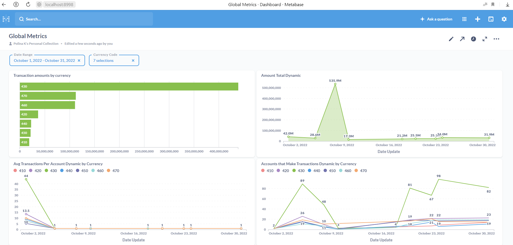

# Итоговый проект

### Структура репозитория

Внутри `src` расположены папки:
- `/src/py` - код spark streaming для чтения данных из топика и записи в staging-слой Vertica: `1_data_import.py`.
- `/src/dags` DAG, который обновляет витрину данных: `2_datamart_update.py`.
- `/src/sql` - SQL-запрос создания таблиц в `STAGING`- и `DWH`-слоях
- `/src/dags/sql` - SQL-запрос для обновления итоговой витрины.
- `/src/img` - скриншот дашборда.

## Способ реализации
Выгрузка данных из Kafka с помощью модулей Apache Hadoop в STAGING-слой, последующая поставка данных из в DWH.

## Шаг 1. Изучение входных данных
Прочитмаем сообщения в топике Kafka и посмотрим на их структуру
```bash
kafkacat -b rc1a-1im2demdsu72o02i.mdb.yandexcloud.net:9091\
-X security.protocol=SASL_SSL\
-X sasl.mechanisms=SCRAM-SHA-512 \
-X sasl.username="username" \
-X sasl.password="password" \
-X ssl.ca.location="/usr/local/share/ca-certificates/Yandex/YandexInternalRootCA.crt" \
-t transaction-service-input \
-o beginning
```

**Объет CURRENCY**
```json
{
    "object_id": "46325318-1074-5097-8c34-eface3e32f60",
    "object_type": "CURRENCY",
    "sent_dttm": "2022-10-14T00:00:00",
    "payload": {
        "date_update": "2022-10-14 00:00:00",
        "currency_code": 470,
        "currency_code_with": 420,
        "currency_with_div": 0.95
    }
}
```
* date_update — дата обновления курса валют;
* currency_code — трёхзначный код валюты транзакции;
* currency_code_with — отношение другой валюты к валюте трёхзначного кода;
* currency_code_div — значение отношения единицы одной валюты к единице валюты транзакции.

**Объет TRANSACTION**
```json
{
    "object_id": "001f29be-497f-4faa-aa29-96a334891094",
    "object_type": "TRANSACTION",
    "sent_dttm": "2022-10-23T10:25:58",
    "payload": {
        "operation_id": "001f29be-497f-4faa-aa29-96a334891094",
        "account_number_from": 6182399,
        "account_number_to": 8509580,
        "currency_code": 430,
        "country": "russia",
        "status": "queued",
        "transaction_type": "sbp_incoming",
        "amount": 200000,
        "transaction_dt": "2022-10-23 10:25:58"
    }
}
```
* operation_id — id транзакции;
* account_number_from — внутренний бухгалтерский номер счёта транзакции ОТ КОГО;
* account_number_to — внутренний бухгалтерский номер счёта транзакции К КОМУ;
* currency_code — трёхзначный код валюты страны, из которой идёт транзакция;
* country — страна-источник транзакции;
* status — статус проведения транзакции:
  * queued («транзакция в очереди на обработку сервисом»),
  * in_progress («транзакция в обработке»),
  * blocked («транзакция заблокирована сервисом»),
  * done («транзакция выполнена успешно»),
  * chargeback («пользователь осуществил возврат по транзакции»).
* transaction_type — тип транзакции во внутреннем учёте:
  * authorisation («авторизационная транзакция, подтверждающая наличие счёта пользователя»),
  * sbp_incoming («входящий перевод по системе быстрых платежей»),
  * sbp_outgoing («исходящий перевод по системе быстрых платежей»),
  * transfer_incoming («входящий перевод по счёту»),
  * transfer_outgoing («исходящий перевод по счёту»),
  * c2b_partner_incoming («перевод от юридического лица»),
  * c2b_partner_outgoing («перевод юридическому лицу»).
* amount — целочисленная сумма транзакции в минимальной единице валюты страны (копейка, цент, куруш);
* transaction_dt — дата и время исполнения транзакции до миллисекунд.

## Шаг 2. Подготовка таблиц в Vertica

1) В схеме STAGING заведём таблицы `transactions` и `currencies`:\
*/src/sql/create_staging.sql*

2) В схеме DWH заведём витрину `global_metrics`:\
*/src/dags/sql/create_dwh.sql*

Значения полей в витрине:
* date_update — дата расчёта,
* currency_from — код валюты транзакции;
* amount_total — общая сумма транзакций по валюте в долларах;
* cnt_transactions — общий объём транзакций по валюте;
* avg_transactions_per_account — средний объём транзакций с аккаунта;
* cnt_accounts_make_transactions — количество уникальных аккаунтов с совершёнными транзакциями по валюте.

## Шаг 3. Spark Streaming из Kafka в stagging слой в Vertica:
*/src/py/1_data_import.py*

## Шаг 4. Пайплайн обновления витрины данных в Airflow
1) В Airflow заведём Connection со следующими настройками:
```
Connection Id   VERTICA_CONN
Connrction Type Generic
Extra           {"host": "51.250.75.20",
                 "port": "5433",
                 "user": "PDKUDRYAVTSEVAYANDEXRU",
                 "password": "5VTdU98bfAp2c1s",
                 "database": "dwh"}

```
2) Напишем DAG, который на ежедневной основе будет рассчитывать и догружать метрики в витрину:\
*/src/dags/2_datamart_update.py*\
\
DAG просто по расписанию выполняет SQL-запрос:\
*/src/dags/sql/mart_query_daily.sql*

3) Установим модуль vertica-python в контейнере с Airflow:
```bash
pip install vertica-python
```

4) Подождём, когда отработают все DAGRUNs за период с 1 по 31 октября 2022.

## Шаг 5. Создание дашборда
1) В контейнере с metabase добавим *vertica-jdbc-11.0.2-0.jar* в папку */opt/metabase/plugins* и перезапустим контейнер.

2) Добавим в Metabase подключение к Vertica

3) Нарисуем Dashboard:


